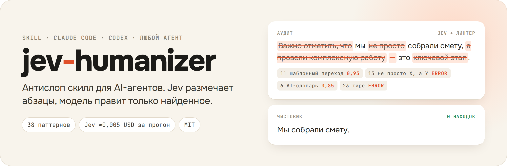
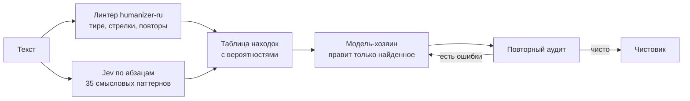
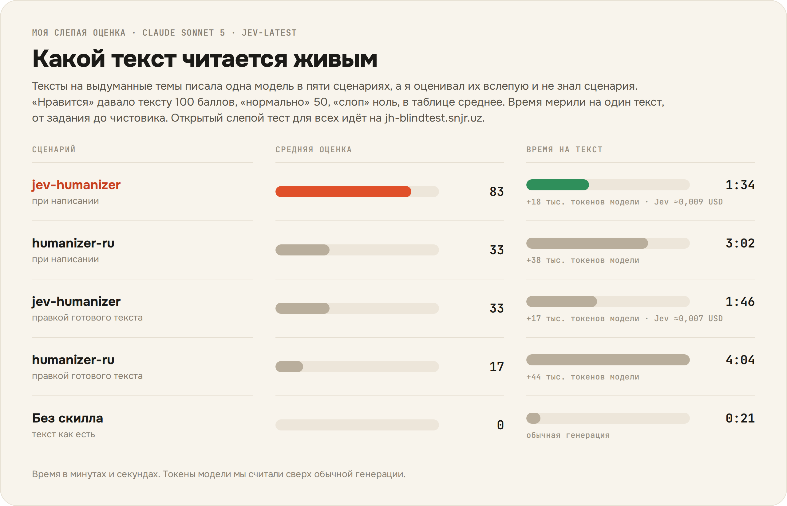

<p align="center">
  
</p>

<p align="center">
  <a href="LICENSE"></a>
  
  
  <a href="https://github.com/smixs/humanizer-ru"></a>
</p>

<p align="center">
  <a href="#установка">Установка</a> ·
  <a href="#использование">Использование</a> ·
  <a href="#как-это-работает">Как работает</a> ·
  <a href="#результаты">Результаты</a> ·
  <a href="https://jh-blindtest.snjr.uz">Слепой тест</a> ·
  <a href="#источники">Источники</a> ·
  <a href="#in-english">English</a>
</p>

Антислоп скилл для AI-агентов: Claude Code, Codex и любых других, читающих SKILL.md. Помогает убрать из текста канцелярит, штампы, ложные противопоставления, длинные тире и воду, по которым читатель узнаёт нейросеть. Факты и цифры остаются на месте.

Искать слоп модели не нужно. Это делает [Jev](https://typesafe.ai) от TypeSafe AI, классификатор, который не пишет текст и отвечает только вероятностями. Он проверяет каждый абзац на 35 смысловых паттернов, линтер добавляет механику вроде тире и стрелок. Модель получает таблицу находок и правит только отмеченные места. Свои любимые обороты она не замечает, а классификатор замечает, и стоит это меньше цента за пост.

Справочник и линтер пока знают только русский, а Jev читает и английский. На примере из blader/humanizer он поймал «not just X, it's Y», длинное тире и эмодзи, но пропустил «Let that sink in» и риторический вопрос.

## Установка

Понадобятся Python 3 без дополнительных пакетов и ключ Jev с [typesafe.ai](https://typesafe.ai).

```bash
git clone https://github.com/snjrusmn/jev-humanizer.git ~/projects/jev-humanizer

# Claude Code
mkdir -p ~/.claude/skills
ln -s ~/projects/jev-humanizer/skill ~/.claude/skills/jev-humanizer

# Codex
mkdir -p ~/.codex/skills
ln -s ~/projects/jev-humanizer/skill ~/.codex/skills/jev-humanizer

# ключ Jev: переменная TYPESAFE_API_KEY или файл
mkdir -p ~/.config
echo 'TYPESAFE_API_KEY=ваш_ключ' > ~/.config/typesafe.env
chmod 600 ~/.config/typesafe.env
```


Другие агенты подключают тот же [`skill/SKILL.md`](skill/SKILL.md) из своей папки скиллов. Репозиторий скилл ищет в `~/projects/jev-humanizer`, другой путь задаёт переменная `JEVH`.

## Использование

Отдельно звать скилл не нужно, он включается сам, когда агент пишет письмо, сообщение или пост. Готовый текст можно отдать на правку фразами «убери воду», «очеловечь», «перепиши человечнее».

Для проверки без правки скажите «проверь, палится ли текст на ИИ». Скилл вернёт таблицу улик с цитатами и вердикт, а сам текст не тронет.

В терминале аудит работает и без агента:

```bash
cd ~/projects/jev-humanizer
python3 -m jev_humanizer.audit текст.md               # таблица находок
python3 -m jev_humanizer.audit текст.md --sections    # плюс выдержки из справочника
python3 -m jev_humanizer.audit текст.md --json a.json # все оценки и расход токенов
python3 -m jev_humanizer.audit текст.md --no-jev      # только локальный линтер
```


Абзацы текста уходят в API TypeSafe в США. С флагом `--no-jev` текст остаётся на машине, но тогда текст проверяет только линтер.

Jev берёт 0,042 USD за миллион входных токенов, выход бесплатный. Пост на 200 слов обходится в 0,0015-0,005 USD за прогон, прогонов обычно два. Это цена только аудита, работу самой модели вы оплачиваете как обычно.

## Как это работает




1. **Аудит.** Линтер и Jev проходят по тексту и собирают таблицу находок. К ней прилагаются выдержки из справочника, только по найденным паттернам.
2. **Правка.** Модель лечит каждую находку: удаляет, заменяет фактом из оригинала или пишет проще. Синоним лечением не считается. Если находок нет, текст возвращается как был.
3. **Проверка.** Чистовик снова идёт на аудит, пока у линтера не останется ни одной ошибки.

Лучше всего скилл работает с первой строки. Модель читает его до черновика, пишет сразу по правилам и потом прогоняет свой текст через эти три шага. Править готовый текст тоже можно, но выходит хуже.

## Результаты

<p align="center">
  
</p>

Это мои личные оценки. По ним jev-humanizer с первой строки заметно обошёл остальные сценарии и при этом тратит на текст вдвое меньше времени, чем humanizer-ru. Правка готового текста в основном меняла тире, а слоп в структуре оставался.

Только я автор и вполне могу подсуживать сам себе. Так что проверяем на людях: **[jh-blindtest.snjr.uz](https://jh-blindtest.snjr.uz)**. Там две версии одного текста без подписей, сами тексты и темы выдуманные. Ставишь каждой «нравится», «норм» или «слоп», выбираешь, какая лучше, и только потом узнаёшь, кто как писал. На одну пару уходит минуты две, а дальше как затянет. Статистику выложу сюда, даже если она меня расстроит.

## Устройство

| Путь | Что там |
| --- | --- |
| [`skill/SKILL.md`](skill/SKILL.md) | скилл для модели: режимы, фазы, запреты, голос |
| [`jev_humanizer/`](jev_humanizer) | аудит: линтер humanizer-ru плюс Jev по абзацам |
| [`vendor/humanizer-ru/`](vendor/humanizer-ru) | humanizer-ru v1.7 без изменений |
| [`tests/`](tests) | тесты аудита, `python3 -m unittest discover -s tests` |

## Источники

- [humanizer](https://github.com/blader/humanizer) от [@blader](https://github.com/blader) - основа всей линии
- [Wikipedia: Signs of AI writing](https://en.wikipedia.org/wiki/Wikipedia:Signs_of_AI_writing), на котором построен humanizer
- [humanizer-ru](https://github.com/smixs/humanizer-ru) от Serge Shima - русская адаптация, отсюда 38 паттернов и линтер. Копия лежит в `vendor/humanizer-ru` без изменений (v1.7, коммит `ff990df`)
- [Jev](https://typesafe.ai) от TypeSafe AI - классификатор для аудита

Если нужен редактор без внешнего API, берите humanizer-ru. Для английского текста лучше подойдёт humanizer от blader.

## Лицензия

[MIT](LICENSE). `vendor/humanizer-ru` распространяется под MIT © 2026 Serge Shima.

## In English

jev-humanizer is an anti-slop skill for AI agents (Claude Code, Codex, anything that reads `SKILL.md`). Detection runs on [Jev](https://typesafe.ai) by TypeSafe AI, a classifier that scores every paragraph against 35 semantic patterns for under a cent per post, and the host model rewrites only what was flagged. The pattern reference and the linter come from [smixs/humanizer-ru](https://github.com/smixs/humanizer-ru), a Russian adaptation of [blader/humanizer](https://github.com/blader/humanizer), so today the tool is tuned for Russian. Jev reads English too and catches structural tells such as "not just X, it's Y". In the author's own blind rating, writing with it from the first draft scored 83 out of 100 against 33 for humanizer-ru and took about a minute and a half per text instead of three. A public blind test is open at [jh-blindtest.snjr.uz](https://jh-blindtest.snjr.uz); results will be added here.
